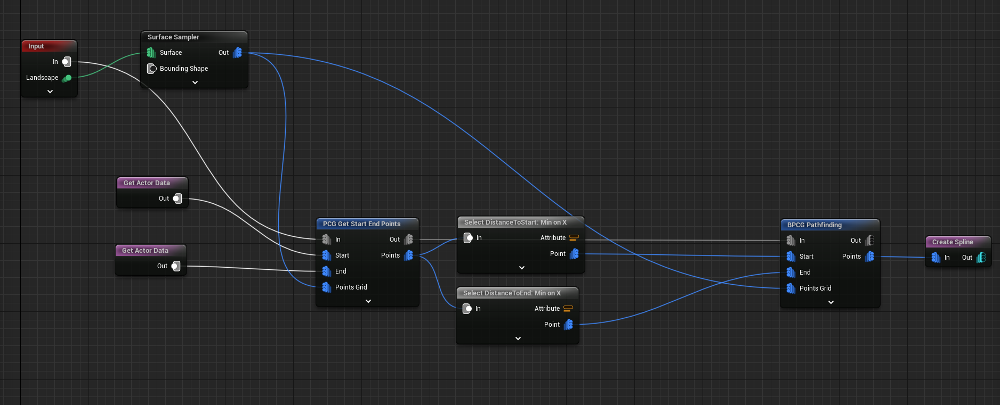

# PCGPathfinding

An A* pathfinding implementation that can be used with PCG (Procedural Content Generation) to generate custom splines.

Project is made in Unreal 5.2

# PCG Graph:

# Explanation:

1. Surface Sampler generates a grid of points with settings:
- Points Per Squared Meter = 1.0
- Point Extents = (500,500,500)
- Looseness = 0.0
2. 2 Get Actor Data nodes find an object with tag "Start" and "End"
3. **PCG Get Start End Points** goes through each point on the sampled grid (from step 1) and adds attributes for DistanceToStart and DistanceToEnd and outputs them.
4. Select the smallest DistanceToStart and DistanceToEnd and passes them as points to the BPCG Pathfinding node
5. BPCG Pathfinding does some magic to calculate the shortest path between the start and end in the A* pathfinding and outputs it as Points
6. These Points are passed to Create Spline

Demonstration Video:

